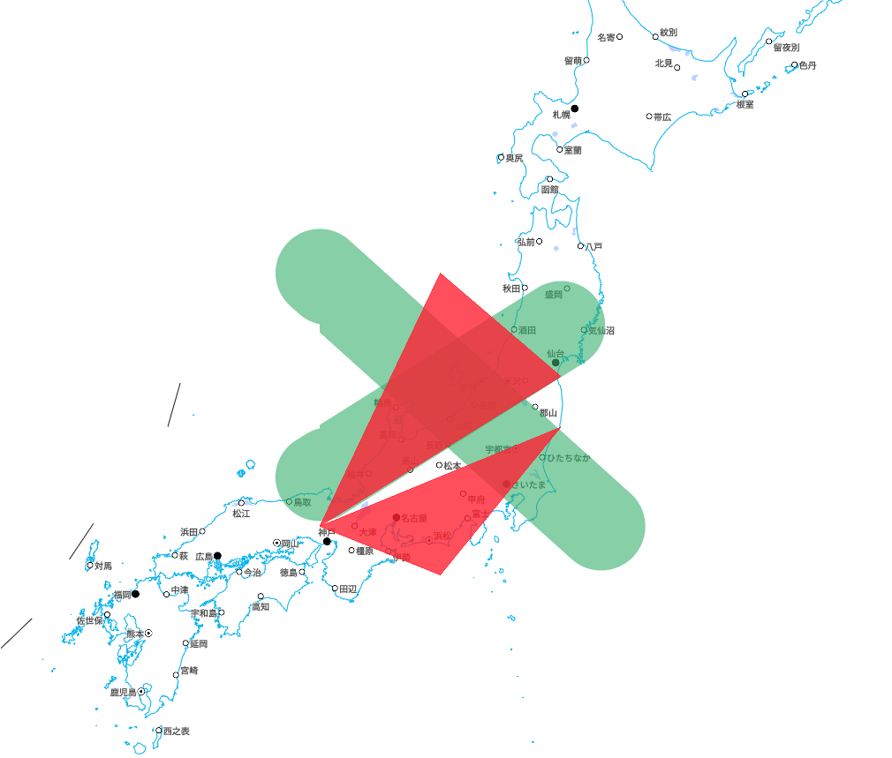

<!-- README.md is generated from README.Rmd. Please edit that file -->

```{r, include = FALSE}
knitr::opts_chunk$set(
  collapse = TRUE,
  comment = "#>"
)
```

#  An attempt to generate MVT files by sf and serve them on GitHub Pages

This repository is for

* Testing MVT file generation by [sf](https://github.com/r-spatial/sf/).
* Showing the usefulness of using [地理院地図Vector（仮称）](https://maps.gsi.go.jp/vector/) with [Mapbox GL JS](https://github.com/mapbox/mapbox-gl-js) (I don't need Mapbox access token thanks to 地理院地図Vector（仮称）'s vector tiles!).

The HTML code and style.json are mainly from <https://github.com/gsi-cyberjapan/gsivectortile-mapbox-gl-js>.

## Generate MVT files

```{r}
library(sf)

data_dir <- here::here("data")

point <- st_sfc(
  st_point(c(35.6809591, 139.7673068)),
  st_point(c(35.6598003, 139.7023894)),
  crs = 4326
)

linestring <- st_sfc(
  st_linestring(rbind(c(135, 40), c(142, 35))),
  st_linestring(rbind(c(135, 36), c(141, 39))),
  crs = 4326
)

polygon <- st_sfc(
  st_polygon(list(rbind(c(135, 35), c(138, 40), c(141, 38), c(135, 35)))),
  st_polygon(list(rbind(c(135, 35), c(141, 37), c(138, 34), c(135, 35)))),
  crs = 4326
)

unlink(data_dir, recursive = TRUE)
dir.create(data_dir)

write_mvt <- function(x) {
  name <- deparse(substitute(x))
  write_sf(
    x,
    dsn = file.path(data_dir, name),
    layer = name,
    driver = "MVT",
    dataset_options = c("MINZOOM=4", "MAXZOOM=9", "TILE_EXTENSION=mvt", "COMPRESS=NO")
  )
}

write_mvt(point) # TODO: doesn't work. why...?
write_mvt(linestring)
write_mvt(polygon)
```

## HTML Code

* [index.html](index.html)

## Style

**This is just a copy of <https://github.com/gsi-cyberjapan/gsivectortile-mapbox-gl-js/blob/master/std.json>**

* [std.json](std.json)

## Result

<https://yutannihilation.github.io/generate-mvt-by-sf-test/index.html>

### Screenshot

 (地理院地図Vector（仮称）提供のベクトルタイルを使用して作成)